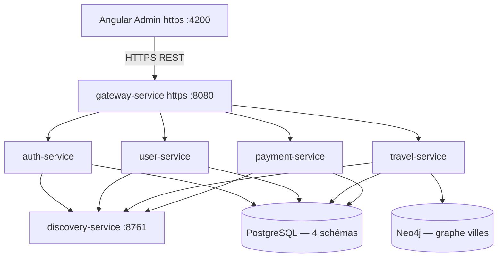

# Travel Management System — Architecture (version finale)

> **Phase 1 validée** — Projet étudiant  
> Stack : Java 17 · Spring Boot 3 · Angular · PostgreSQL · Neo4j · Docker

---

## 1. Objectif

Plateforme de gestion de voyages en **microservices**, calquée sur l'approche du projet Buy-01 (Nexus) :

| Couche | Technologie |
|--------|-------------|
| Backend | Java 17, Spring Boot 3, Spring Cloud (Eureka + Gateway) |
| Frontend | Angular — dashboard admin (Phase 4) |
| Données relationnelles | PostgreSQL 16 — **1 instance, 4 schémas** |
| Données graphe | Neo4j 5 — itinéraires entre villes (travel-service) |
| Infra | Docker Compose (Phase 2) |
| CI/CD | Jenkins + SonarQube (Phase 5) |

---

## 2. Vue d'ensemble



**Flux :** `Angular → Gateway → Microservice → PostgreSQL / Neo4j`

---

## 3. Microservices

| Service | Rôle | Données |
|---------|------|---------|
| **discovery-service** | Registre Eureka | — |
| **gateway-service** | Point d'entrée, routage, CORS | — |
| **auth-service** | Register, login, émission JWT | PostgreSQL `auth` |
| **user-service** | Profils, rôle USER / ADMIN | PostgreSQL `user` |
| **travel-service** | Voyages, réservations, recherche d'itinéraires | PostgreSQL `travel` + Neo4j |
| **payment-service** | Paiement mock, remboursement | PostgreSQL `payment` |

### Ce qu'on ne fait PAS (hors scope étudiant)

- Kafka / messaging asynchrone
- Refresh token avec rotation en BDD
- Saga distribuée
- PSP réel (paiement simulé)
- Audit trail paiement

---

## 4. Répartition PostgreSQL vs Neo4j

| Donnée | PostgreSQL | Neo4j |
|--------|:----------:|:-----:|
| Comptes / login | ✅ | — |
| Profils / rôles | ✅ | — |
| Voyages, places, réservations | ✅ | — |
| Paiements | ✅ | — |
| Graphe villes + connexions | — | ✅ |
| Recherche itinéraire multi-villes | — | ✅ |

**Règle :** PostgreSQL = source de vérité métier. Neo4j = recherche de routes uniquement.

---

## 5. Fiches services

### auth-service

- **API :** `/api/auth/register`, `/api/auth/login`
- **BDD :** schéma `auth` — table `users_auth`
- **JWT :** HS256, secret partagé (`JWT_SECRET`), durée 24 h
- **À l'inscription :** crée le credential puis appelle user-service pour le profil

### user-service

- **API :** `/api/users/me`, `/api/users/{id}`, `/api/users` (admin)
- **BDD :** schéma `user` — table `users` (colonne `role`)
- **Rôles :** `USER`, `ADMIN`

### travel-service

- **API :** `/api/travels`, `/api/travels/routes/search`, `/api/bookings`
- **BDD :** schéma `travel` — tables `trips`, `bookings`
- **Neo4j :** nœuds `City`, relation `CONNECTS_TO`
- **Réservation :** appelle payment-service en REST synchrone

### payment-service

- **API :** `/api/payments`, `/api/payments/{id}/refund`
- **BDD :** schéma `payment` — table `payments`
- **Mock :** tout paiement réussit sauf si montant = 0

---

## 6. Cas d'usage

| ID | Acteur | Action |
|----|--------|--------|
| UC-01 | Tous | S'inscrire / se connecter |
| UC-02 | Tous | Consulter le catalogue voyages |
| UC-03 | Tous | Rechercher un itinéraire (Neo4j) |
| UC-04 | User | Réserver et payer |
| UC-05 | User | Voir ses réservations |
| UC-06 | User | Annuler une réservation |
| UC-07 | Admin | Gérer utilisateurs |
| UC-08 | Admin | Gérer voyages |
| UC-09 | Admin | Voir les paiements |

---

## 7. Structure du projet

```
travel/
├── docs/architecture/
├── microservices/
│   ├── discovery-service/
│   ├── gateway-service/
│   ├── auth-service/
│   ├── user-service/
│   ├── travel-service/
│   └── payment-service/
├── frontend/travel-admin/
├── infrastructure/
│   └── docker-compose.yml
└── travel-plan.md
```

---

## 8. Décisions validées

| # | Décision |
|---|----------|
| 1 | 6 microservices (4 métier + discovery + gateway) — conforme au plan |
| 2 | 1 PostgreSQL, 4 schémas (pas 4 containers) |
| 3 | Neo4j limité au graphe de villes (travel-service) |
| 4 | Communication **REST synchrone uniquement** |
| 5 | JWT simple HS256, 24 h, pas de refresh token |
| 6 | Chaque service valide le JWT avec le même secret |
| 7 | Paiement mock, pas de vraie carte bancaire |
| 8 | Aligné sur Buy-01 (Eureka, Gateway, Spring Boot 3) |
| 9 | **HTTPS** obligatoire : Gateway + Angular (`ng serve --ssl`) |

---

## 9. Documents

| Fichier | Contenu |
|---------|---------|
| [COMMUNICATION.md](./COMMUNICATION.md) | REST, Gateway, appels inter-services |
| [SECURITY.md](./SECURITY.md) | JWT, rôles, CORS |
| [database/postgresql.md](./database/postgresql.md) | Schémas SQL |
| [database/neo4j.md](./database/neo4j.md) | Modèle graphe |
| [api/](./api/) | OpenAPI simplifiés |
| [sequences/](./sequences/) | Flux login, booking, annulation |
| [PHASE1-CHECKLIST.md](./PHASE1-CHECKLIST.md) | Validation Phase 1 |
