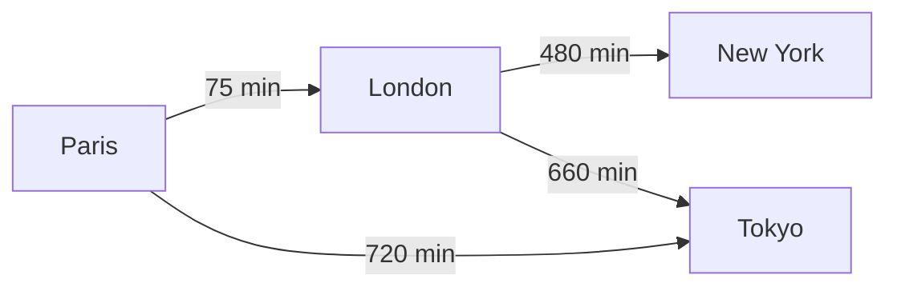

# Modèle Neo4j

> Version finale — Graphe simple de villes (travel-service uniquement)

---

## Pourquoi Neo4j ?

PostgreSQL gère voyages et réservations.  
Neo4j sert **uniquement** à la recherche d'itinéraires entre villes — cas d'usage typique d'un graphe.

---

## Modèle

### 1 type de nœud : `City`

| Propriété | Exemple |
|-----------|---------|
| name | `"Paris"` |
| country | `"FR"` |

### 1 type de relation : `CONNECTS_TO`

| Propriété | Exemple |
|-----------|---------|
| duration_min | `75` |
| price | `89.00` |

```cypher
CREATE (paris:City {name: 'Paris', country: 'FR'})
CREATE (london:City {name: 'London', country: 'GB'})
CREATE (tokyo:City {name: 'Tokyo', country: 'JP'})
CREATE (newyork:City {name: 'New York', country: 'US'})

CREATE (paris)-[:CONNECTS_TO {duration_min: 75, price: 89.00}]->(london)
CREATE (london)-[:CONNECTS_TO {duration_min: 480, price: 450.00}]->(newyork)
CREATE (paris)-[:CONNECTS_TO {duration_min: 720, price: 650.00}]->(tokyo)
CREATE (london)-[:CONNECTS_TO {duration_min: 660, price: 580.00}]->(tokyo)
```

> Pas de nœuds `Airport`, `Route` — inutile pour un projet étudiant.

---

## Schéma visuel



---

## Requête principale

Recherche de chemins entre deux villes (max 2 escales) :

```cypher
MATCH path = (origin:City {name: $origin})-[:CONNECTS_TO*1..3]->(dest:City {name: $destination})
WITH path,
     [n IN nodes(path) | n.name] AS cities,
     reduce(d = 0, r IN relationships(path) | d + r.duration_min) AS totalDuration,
     reduce(p = 0.0, r IN relationships(path) | p + r.price) AS totalPrice
RETURN cities, totalDuration, totalPrice
ORDER BY totalPrice ASC
LIMIT 5
```

**Endpoint :** `GET /api/travels/routes/search?origin=Paris&destination=Tokyo`

---

## Lien avec PostgreSQL

| Donnée | Où ? |
|--------|------|
| Catalogue voyages (`trips`) | PostgreSQL |
| Recherche itinéraire | Neo4j |
| Réservation | PostgreSQL |

Les voyages en PostgreSQL et le graphe Neo4j sont **indépendants** en v1.  
L'admin peut s'inspirer du graphe pour créer des trips, sans synchronisation automatique.

---

## Configuration (Phase 2)

| Paramètre | Valeur dev |
|-----------|------------|
| URI | `bolt://neo4j:7687` |
| User | `neo4j` |
| Password | variable d'env `NEO4J_PASSWORD` |
| Driver Java | Spring Data Neo4j ou neo4j-java-driver |

---

## Données de seed

4 villes, 4 connexions — suffisant pour démontrer la traversée de graphe à l'oral / soutenance.
