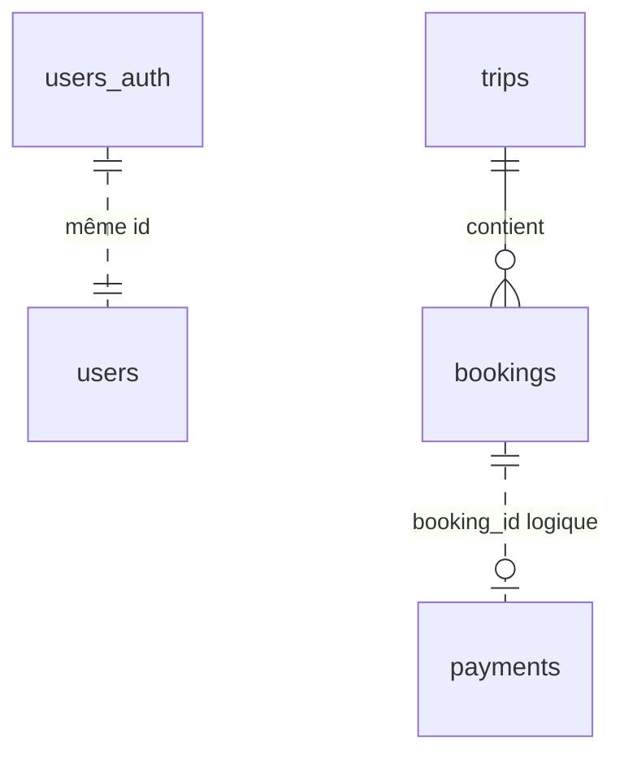

# Schémas PostgreSQL

> Version finale — 1 instance PostgreSQL, 4 schémas

---

## Principe

Un seul container PostgreSQL avec **4 schémas** séparés (un par service).  
IDs en **UUID**. Pas de clé étrangère entre schémas.

```
PostgreSQL (travel_db)
├── auth.users_auth
├── user.users
├── travel.trips
├── travel.bookings
└── payment.payments
```

---

## Schéma `auth`

### `users_auth`

| Colonne | Type | Notes |
|---------|------|-------|
| id | UUID PK | Partagé avec user.users |
| email | VARCHAR(255) UNIQUE | |
| password_hash | VARCHAR(255) | BCrypt |
| created_at | TIMESTAMPTZ | |

```sql
CREATE SCHEMA IF NOT EXISTS auth;

CREATE TABLE auth.users_auth (
    id            UUID PRIMARY KEY DEFAULT gen_random_uuid(),
    email         VARCHAR(255) NOT NULL UNIQUE,
    password_hash VARCHAR(255) NOT NULL,
    created_at    TIMESTAMPTZ NOT NULL DEFAULT now()
);
```

---

## Schéma `user`

### `users`

| Colonne | Type | Notes |
|---------|------|-------|
| id | UUID PK | = auth.users_auth.id |
| email | VARCHAR(255) UNIQUE | |
| first_name | VARCHAR(100) | |
| last_name | VARCHAR(100) | |
| role | VARCHAR(20) | `USER` ou `ADMIN` |
| created_at | TIMESTAMPTZ | |

```sql
CREATE SCHEMA IF NOT EXISTS "user";

CREATE TABLE "user".users (
    id         UUID PRIMARY KEY,
    email      VARCHAR(255) NOT NULL UNIQUE,
    first_name VARCHAR(100) NOT NULL,
    last_name  VARCHAR(100) NOT NULL,
    role       VARCHAR(20) NOT NULL DEFAULT 'USER',
    created_at TIMESTAMPTZ NOT NULL DEFAULT now()
);
```

> Pas de table `roles` / `user_roles` — une colonne `role` suffit pour un projet étudiant.

---

## Schéma `travel`

### `trips`

| Colonne | Type | Notes |
|---------|------|-------|
| id | UUID PK | |
| title | VARCHAR(255) | Ex. "Paris → Tokyo" |
| origin_city | VARCHAR(100) | |
| destination_city | VARCHAR(100) | |
| departure_date | DATE | |
| price | DECIMAL(10,2) | Prix en euros |
| seats_available | INT | |
| status | VARCHAR(20) | `ACTIVE`, `CANCELLED` |
| created_at | TIMESTAMPTZ | |

```sql
CREATE SCHEMA IF NOT EXISTS travel;

CREATE TABLE travel.trips (
    id               UUID PRIMARY KEY DEFAULT gen_random_uuid(),
    title            VARCHAR(255) NOT NULL,
    origin_city      VARCHAR(100) NOT NULL,
    destination_city VARCHAR(100) NOT NULL,
    departure_date   DATE NOT NULL,
    price            DECIMAL(10,2) NOT NULL CHECK (price >= 0),
    seats_available  INT NOT NULL CHECK (seats_available >= 0),
    status           VARCHAR(20) NOT NULL DEFAULT 'ACTIVE',
    created_at       TIMESTAMPTZ NOT NULL DEFAULT now()
);
```

### `bookings`

| Colonne | Type | Notes |
|---------|------|-------|
| id | UUID PK | |
| trip_id | UUID FK → trips | |
| user_id | UUID | Référence logique vers user.users |
| status | VARCHAR(20) | `PENDING`, `CONFIRMED`, `CANCELLED` |
| payment_id | UUID | Référence logique vers payment.payments |
| created_at | TIMESTAMPTZ | |

```sql
CREATE TABLE travel.bookings (
    id         UUID PRIMARY KEY DEFAULT gen_random_uuid(),
    trip_id    UUID NOT NULL REFERENCES travel.trips(id),
    user_id    UUID NOT NULL,
    status     VARCHAR(20) NOT NULL DEFAULT 'PENDING',
    payment_id UUID,
    created_at TIMESTAMPTZ NOT NULL DEFAULT now()
);
```

> Pas de table `travelers` — 1 réservation = 1 utilisateur connecté.

### Statuts booking

```
PENDING ──paiement OK──► CONFIRMED
   │
   └──paiement KO──► CANCELLED

CONFIRMED ──annulation──► CANCELLED
```

---

## Schéma `payment`

### `payments`

| Colonne | Type | Notes |
|---------|------|-------|
| id | UUID PK | |
| booking_id | UUID | Référence logique |
| user_id | UUID | |
| amount | DECIMAL(10,2) | |
| status | VARCHAR(20) | `COMPLETED`, `FAILED`, `REFUNDED` |
| created_at | TIMESTAMPTZ | |

```sql
CREATE SCHEMA IF NOT EXISTS payment;

CREATE TABLE payment.payments (
    id         UUID PRIMARY KEY DEFAULT gen_random_uuid(),
    booking_id UUID NOT NULL,
    user_id    UUID NOT NULL,
    amount     DECIMAL(10,2) NOT NULL CHECK (amount > 0),
    status     VARCHAR(20) NOT NULL DEFAULT 'COMPLETED',
    created_at TIMESTAMPTZ NOT NULL DEFAULT now()
);
```

> Pas de `payment_status_history` — le statut actuel suffit.  
> Pas de `idempotency_key` — flux synchrone simple.

---

## ERD



---

## Flux booking + paiement

```
1. INSERT booking (PENDING)
2. POST payment-service → INSERT payment (COMPLETED ou FAILED)
3. UPDATE booking → CONFIRMED ou CANCELLED
4. Si CONFIRMED : UPDATE trips SET seats_available = seats_available - 1
```
