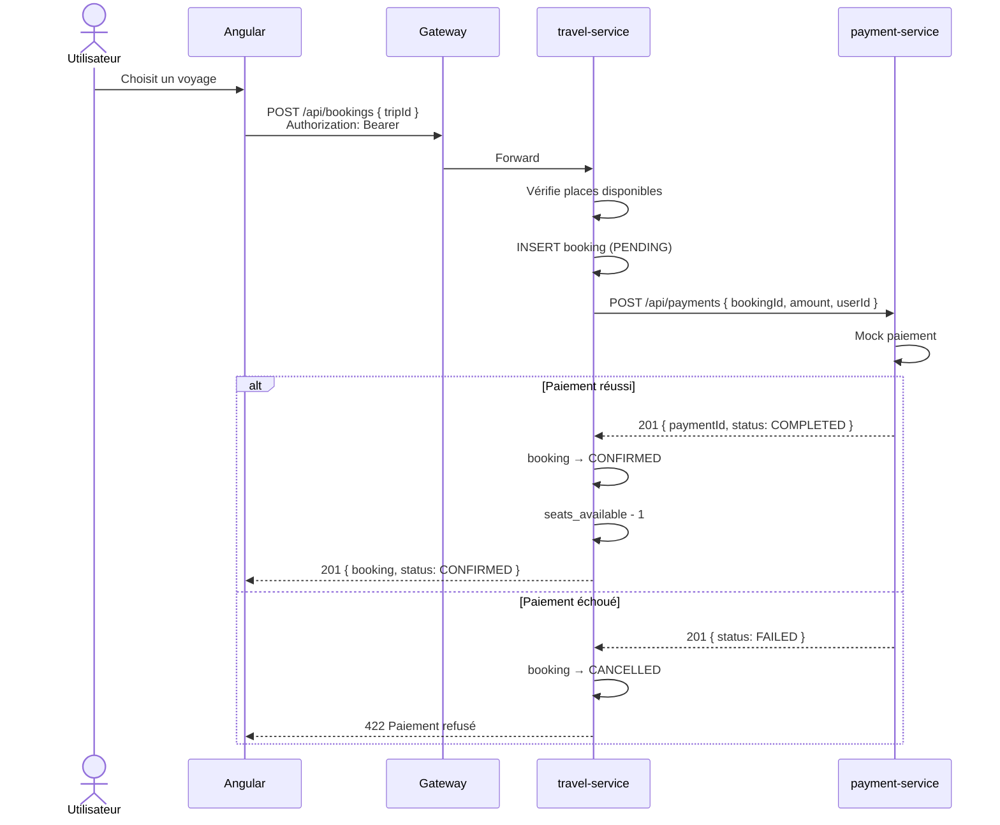

# Séquence — Réservation et Paiement

> Flux 100 % synchrone — une seule requête HTTP côté client



## Statuts

```
PENDING ──OK──► CONFIRMED
   │
   └──KO──► CANCELLED
```

## Mock paiement

Le payment-service accepte tout montant > 0.  
Pour tester l'échec en dev : envoyer `amount = 0`.
