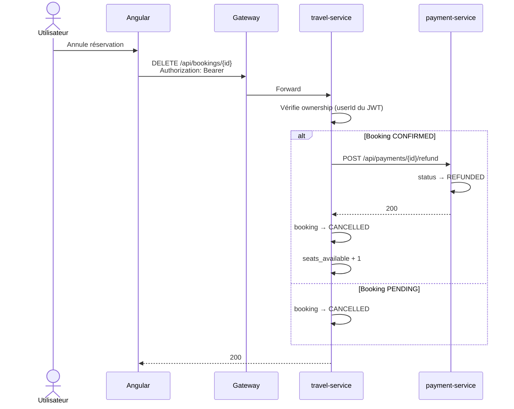

# Séquence — Annulation

## Règles

| Statut initial | Action | Statut final |
|----------------|--------|--------------|
| PENDING | Annulation directe | CANCELLED |
| CONFIRMED | Remboursement + annulation | CANCELLED |
| CANCELLED | Rejet | — |
