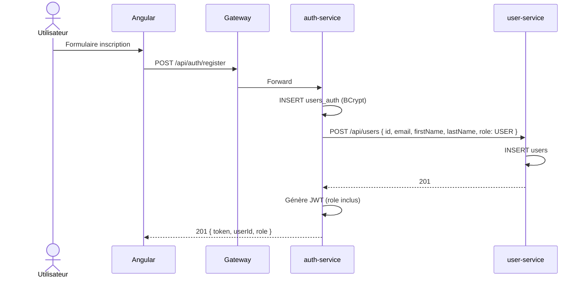
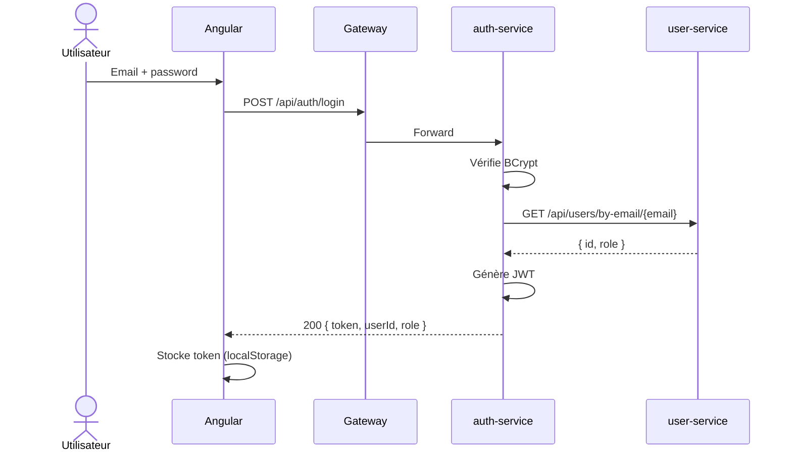
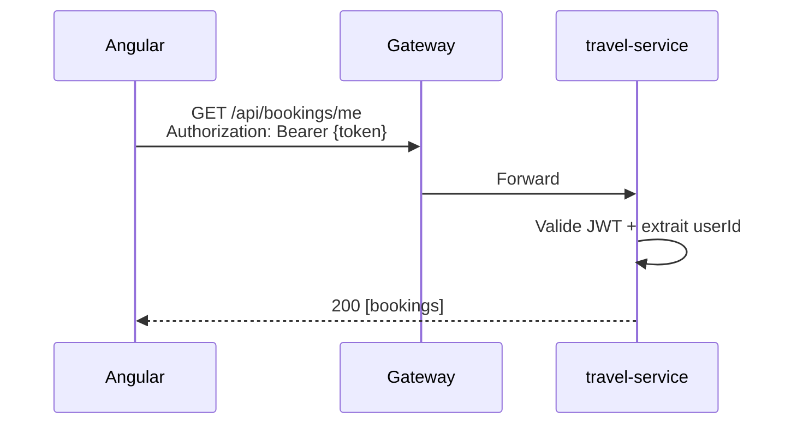

# Séquence — Login et Register

## Register

```mermaid
sequenceDiagram
    actor U as Utilisateur
    participant FE as Angular
    participant GW as Gateway
    participant AUTH as auth-service
    participant USER as user-service

    U->>FE: Formulaire inscription
    FE->>GW: POST /api/auth/register
    GW->>AUTH: Forward

    AUTH->>AUTH: INSERT users_auth (BCrypt)
    AUTH->>USER: POST /api/users { id, email, firstName, lastName, role: USER }
    USER->>USER: INSERT users
    USER-->>AUTH: 201

    AUTH->>AUTH: Génère JWT (role inclus)
    AUTH-->>FE: 201 { token, userId, role }
```

## Login

```mermaid
sequenceDiagram
    actor U as Utilisateur
    participant FE as Angular
    participant GW as Gateway
    participant AUTH as auth-service
    participant USER as user-service

    U->>FE: Email + password
    FE->>GW: POST /api/auth/login
    GW->>AUTH: Forward

    AUTH->>AUTH: Vérifie BCrypt
    AUTH->>USER: GET /api/users/by-email/{email}
    USER-->>AUTH: { id, role }

    AUTH->>AUTH: Génère JWT
    AUTH-->>FE: 200 { token, userId, role }
    FE->>FE: Stocke token (localStorage)
```

## Requête protégée

```mermaid
sequenceDiagram
    participant FE as Angular
    participant GW as Gateway
    participant TRAVEL as travel-service

    FE->>GW: GET /api/bookings/me<br/>Authorization: Bearer {token}
    GW->>TRAVEL: Forward
    TRAVEL->>TRAVEL: Valide JWT + extrait userId
    TRAVEL-->>FE: 200 [bookings]
```
